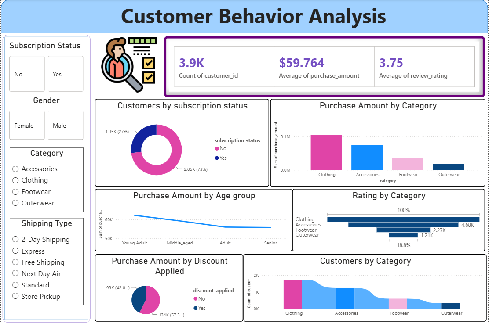

# 🛍️ Customer Shopping Behavior Analysis

<p align="center">
  <strong>End-to-End Data Analytics Project using Python, SQL & Power BI</strong>
</p>

<p align="center">
  
  
  

</p>

---

## 📌 Project Overview

**Customer Shopping Behavior Analysis** is an end-to-end Data Analytics project focused on understanding customer purchasing behavior, product performance, customer engagement, and factors influencing purchase decisions.

The project follows a complete analytics workflow:

**Data Preparation → Exploratory Analysis → SQL Analysis → Power BI Visualization → Business Insights → Recommendations**

Python was used for data preparation and exploratory analysis, SQL was used to perform structured business analysis, and Power BI was used to develop an interactive dashboard for communicating key findings to stakeholders.

The project demonstrates practical Data Analyst skills in transforming raw customer data into meaningful and actionable business insights.

---

## 🎯 Business Problem

A leading retail company wants to better understand its customers' shopping behavior to improve **sales, customer satisfaction, engagement, and long-term loyalty**.

Management wants to identify purchasing patterns across:

- Customer demographics
- Product categories
- Purchase amounts
- Subscription status
- Discount usage
- Customer ratings
- Payment preferences
- Shipping preferences
- Age groups

### Key Business Question

> **How can the company leverage customer shopping data to identify trends, improve customer engagement, and optimize marketing and product strategies?**

---

## 🎯 Project Objectives

The project aims to:

- Understand customer purchasing patterns.
- Analyze customer demographics and behavior.
- Identify high-performing product categories.
- Analyze purchase amounts across customer segments.
- Evaluate customer subscription behavior.
- Understand the impact of discounts on purchases.
- Analyze customer ratings by category.
- Identify important customer and product trends.
- Develop an interactive business dashboard.
- Provide actionable recommendations for decision-makers.

---

## 🗂️ Project Deliverables

| Deliverable | File / Folder | Purpose |
|---|---|---|
| 📁 Business Requirements | `Business Requirements/` | Project requirements and business objectives |
| 📄 Business Insights Report | `Business Insights.pdf` | Key findings, insights and recommendations |
| 📊 Power BI Dashboard | `Customer Behavior Analysis_Dashboard.pbix` | Interactive business intelligence dashboard |
| 🐍 Python Analysis | `Customer Behavior Python Analysis.ipynb` | Data preparation and exploratory analysis |
| 🗄️ SQL Analysis | `Customer Behavior SQL Analysis.sql` | Business-focused SQL queries |
| 🖼️ Dashboard Preview | `Dashboard.png` | Power BI dashboard screenshot |
| 📖 Documentation | `README.md` | Project documentation |

---

## 🔄 Project Workflow

```text
                Raw Customer Shopping Data
                           │
                           ▼
                 Data Preparation
                           │
                           ▼
              Python Exploratory Analysis
                           │
                           ▼
                 SQL Business Analysis
                           │
                           ▼
              KPI & Business Insight Creation
                           │
                           ▼
                 Power BI Dashboard
                           │
                           ▼
             Business Recommendations
                           │
                           ▼
                 Final Insights Report
```

---

## 🛠️ Technology Stack

| Technology | Usage |
|---|---|
| **Python** | Data cleaning, preparation and exploratory analysis |
| **Pandas** | Data manipulation and transformation |
| **NumPy** | Numerical analysis |
| **Matplotlib** | Data visualization |
| **SQL** | Business analysis and analytical queries |
| **Power BI** | Interactive dashboard and KPI visualization |
| **Google Colab / Jupyter** | Python development environment |

---

# 🐍 1. Python Data Analysis

Python was used to prepare the dataset and perform exploratory analysis before business reporting.

### Key Activities

- Imported and inspected the dataset.
- Reviewed dataset structure and data types.
- Checked data quality.
- Performed data cleaning and preparation.
- Analyzed customer demographics.
- Examined purchase amounts.
- Analyzed product categories.
- Studied customer ratings.
- Investigated subscription behavior.
- Analyzed discount usage.
- Explored purchasing patterns across age groups.
- Created visualizations to identify trends and patterns.

### Libraries Used

```python
import pandas as pd
import numpy as np
import matplotlib.pyplot as plt
```

### Python Deliverable

`Customer Behavior Python Analysis.ipynb`

---

# 🗄️ 2. SQL Business Analysis

SQL was used to convert the prepared customer data into business-focused analysis.

### Areas of Analysis

- Customer purchase behavior
- Product category performance
- Purchase amount analysis
- Customer segmentation
- Subscription analysis
- Discount analysis
- Customer rating analysis
- Demographic analysis
- Payment behavior
- Purchase frequency
- Business performance metrics

The SQL analysis provides structured answers to business questions and supports the insights presented in the Power BI dashboard.

### SQL Deliverable

`Customer Behavior SQL Analysis.sql`

---

# 📊 3. Power BI Dashboard

The Power BI dashboard provides an interactive view of customer shopping behavior and business performance.

## Key Dashboard KPIs

The dashboard reports:

- **3.9K Customers**
- **$59.764 Average Purchase Amount**
- **3.75 Average Review Rating**

## Dashboard Components

The dashboard includes analysis of:

- Subscription Status
- Gender
- Product Category
- Shipping Type
- Purchase Amount by Category
- Customers by Subscription Status
- Purchase Amount by Age Group
- Rating by Category
- Purchase Amount by Discount Applied
- Customers by Category

### Interactive Filters

Users can explore the dashboard using:

- Subscription Status
- Gender
- Category
- Shipping Type

This enables stakeholders to analyze customer behavior from different business perspectives.

---

# 🖼️ Dashboard Preview



---

# 🔍 4. Business Insights

## 👥 Customer & Subscription Insights

The dashboard analyzes approximately **3.9K customers**, with non-subscribed customers representing the larger customer group.

This indicates an opportunity to increase subscription adoption through stronger loyalty and membership benefits.

### Business Implication

The company can strengthen subscription programs by offering:

- Exclusive discounts
- Loyalty rewards
- Personalized offers
- Early access to products
- Free or priority shipping

---

## 🛍️ Product Category Insights

The dashboard analyzes four major categories:

- Clothing
- Accessories
- Footwear
- Outerwear

**Clothing** shows the strongest performance in terms of purchase amount and customer volume in the dashboard.

Accessories also contribute significantly, while Footwear and Outerwear show comparatively lower performance.

### Business Implication

The company should maintain strong inventory and marketing focus on high-performing categories while investigating the reasons for lower performance in other categories.

---

## 👤 Age Group Insights

Purchase amount varies across different customer age groups.

The dashboard shows that the **Young Adult** group contributes the highest purchase amount among the displayed age groups, followed by Middle-aged, Adult, and Senior customers.

### Business Implication

Marketing campaigns can be customized according to age-group purchasing behavior instead of applying the same strategy to all customers.

---

## ⭐ Customer Rating Insights

The overall average review rating shown in the dashboard is approximately **3.75**.

Category-level rating analysis helps identify customer satisfaction patterns across different product categories.

### Business Implication

Customer feedback should be monitored by category to identify opportunities for improving product quality, service experience, and customer satisfaction.

---

## 🏷️ Discount Insights

The dashboard compares purchase amounts based on whether discounts were applied.

Both discounted and non-discounted purchases contribute significantly to the overall purchase amount.

### Business Implication

Discounts should be used strategically rather than universally. Customers who are more responsive to promotions can be targeted with personalized offers.

---

## 🚚 Shipping Preference Insights

The dashboard provides analysis using different shipping options:

- 2-Day Shipping
- Express
- Free Shipping
- Next Day Air
- Standard
- Store Pickup

### Business Implication

Understanding shipping preferences can help the business optimize delivery options, customer experience, and logistics costs.

---

# 📌 5. Key Business Findings

| Business Area | Finding | Business Opportunity |
|---|---|---|
| Customers | Approximately 3.9K customers analyzed | Develop targeted customer segments |
| Subscription | Non-subscribers represent the larger group | Increase subscription conversion |
| Purchase Value | Average purchase is approximately $59.76 | Increase basket size through cross-selling |
| Rating | Average rating is approximately 3.75 | Improve customer experience |
| Category | Clothing leads category performance | Maintain inventory and marketing focus |
| Age Group | Young Adults show the highest purchase amount | Develop targeted campaigns |
| Discounts | Both discounted and non-discounted purchases contribute significantly | Optimize promotional strategies |
| Shipping | Multiple shipping preferences are available | Improve delivery personalization |

---

# 💡 6. Business Recommendations

## 1. Increase Subscription Adoption

Develop stronger subscription benefits such as:

- Exclusive discounts
- Loyalty rewards
- Personalized offers
- Early access to products
- Free or priority shipping

---

## 2. Focus on High-Performing Categories

Clothing shows strong customer and purchase performance.

The company should:

- Maintain sufficient inventory.
- Promote best-selling products.
- Identify cross-selling opportunities.
- Use high-performing products to attract new customers.

---

## 3. Improve Underperforming Categories

Footwear and Outerwear show comparatively lower performance.

Further analysis should investigate:

- Product demand
- Pricing
- Customer preferences
- Discounts
- Product availability
- Customer ratings

---

## 4. Implement Customer Segmentation

Customers can be segmented based on:

- Purchase amount
- Purchase frequency
- Age
- Subscription status
- Product preferences
- Discount response

This can enable more personalized marketing campaigns.

---

## 5. Optimize Discount Strategy

Instead of offering discounts to every customer, identify customers who are most likely to respond to promotions.

This can improve:

- Marketing ROI
- Customer conversion
- Customer retention
- Profitability

---

## 6. Improve Customer Experience

Use review ratings and purchasing behavior to identify areas where customer satisfaction can be improved.

Categories with lower ratings should receive additional attention.

---

## 7. Develop Personalized Marketing

Use customer behavior to create personalized campaigns based on:

- Previous purchases
- Preferred categories
- Spending behavior
- Age group
- Subscription status
- Discount preferences

---

# 📈 7. Stakeholder Value

The Power BI dashboard provides stakeholders with a centralized view of customer behavior and business performance.

### Marketing Team

Can identify customer segments and develop targeted campaigns.

### Sales Team

Can identify high-performing categories and purchasing patterns.

### Customer Relationship Team

Can analyze subscription behavior, ratings, and customer engagement.

### Management

Can monitor KPIs and use data-driven insights for strategic decisions.

### Product Team

Can evaluate category performance and customer preferences.

---

# 🧠 8. Skills Demonstrated

## Data Analytics

- Data Cleaning
- Data Preparation
- Exploratory Data Analysis
- Customer Behavior Analysis
- Sales Analysis
- Customer Segmentation
- Statistical Analysis
- Business Analysis
- KPI Analysis

## Python

- Python
- Pandas
- NumPy
- Matplotlib
- Jupyter / Google Colab

## SQL

- SELECT Statements
- Filtering
- Aggregation
- GROUP BY
- ORDER BY
- CASE Statements
- Business Metrics
- Analytical Queries

## Power BI

- Dashboard Development
- KPI Cards
- Interactive Filters
- Data Visualization
- Business Reporting
- Data Storytelling

---

# 📊 Data Analytics Concepts

- Exploratory Data Analysis
- Descriptive Analysis
- Customer Segmentation
- Sales Performance Analysis
- Product Performance Analysis
- Customer Behavior Analysis
- Trend Analysis
- KPI Development
- Data Visualization
- Business Intelligence
- Data Storytelling
- Data-Driven Decision Making

---

# 📁 Repository Structure

```text
Customer-Shopping-Behavior-Analysis/
│
├── Business Requirements/
│   └── Project requirements and business documentation
│
├── Business Insights.pdf
│
├── Customer Behavior Analysis_Dashboard.pbix
│
├── Customer Behavior Python Analysis.ipynb
│
├── Customer Behavior SQL Analysis.sql
│
├── Dashboard.png
│
└── README.md
```

---

# 📄 Project Documentation

### 📋 Business Requirements

The `Business Requirements` folder contains the project requirements, business problem, objectives, and expected deliverables.

### 📊 Business Insights Report

`Business Insights.pdf` contains the key analytical findings, business insights, and recommendations derived from the project.

### 📈 Power BI Dashboard

`Customer Behavior Analysis_Dashboard.pbix` contains the interactive Power BI dashboard.

### 🐍 Python Analysis

`Customer Behavior Python Analysis.ipynb` contains the Python-based data preparation, exploratory analysis, and visualizations.

### 🗄️ SQL Analysis

`Customer Behavior SQL Analysis.sql` contains the SQL queries used to perform business-focused analysis.

### 🖼️ Dashboard Image

`Dashboard.png` provides a preview of the Power BI dashboard.

---

# 🚀 Future Enhancements

The project can be further enhanced by:

- Implementing advanced customer segmentation using Machine Learning.
- Developing Customer Lifetime Value (CLV) analysis.
- Building customer churn prediction models.
- Developing a product recommendation system.
- Creating sales forecasting models.
- Adding automated Power BI data refresh.
- Integrating real-time customer transaction data.
- Developing customer propensity models.
- Creating advanced customer retention analytics.

---

# 🏆 Project Outcome

This project demonstrates the complete lifecycle of a practical **Data Analytics and Business Intelligence solution**.

### The project combines:

**Python** → Data Preparation & Exploratory Analysis

**SQL** → Business Analysis & Querying

**Power BI** → Visualization & Dashboarding

**Business Insights** → Recommendations & Decision Support

The final solution transforms customer shopping data into actionable insights that can help a retail organization improve:

- Customer engagement
- Sales performance
- Marketing effectiveness
- Product strategy
- Customer satisfaction
- Customer retention

---

# ⭐ Project Highlights

- ✅ End-to-End Data Analytics Project
- ✅ Python Data Preparation & EDA
- ✅ SQL Business Analysis
- ✅ Interactive Power BI Dashboard
- ✅ Customer Behavior Analysis
- ✅ Product & Sales Performance Analysis
- ✅ Customer Segmentation
- ✅ KPI Analysis
- ✅ Business Insights Report
- ✅ Business Recommendations
- ✅ Professional GitHub Documentation

---

# 👩‍💻 Author

## Greeshma R Krishnan
**Skills:** Python | SQL | Power BI | Excel | Data Analysis | Data Visualization

---

<p align="center">
  <strong>⭐ Thank you for visiting this project!</strong>
</p>
